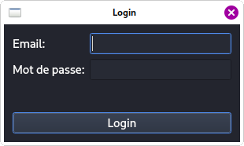
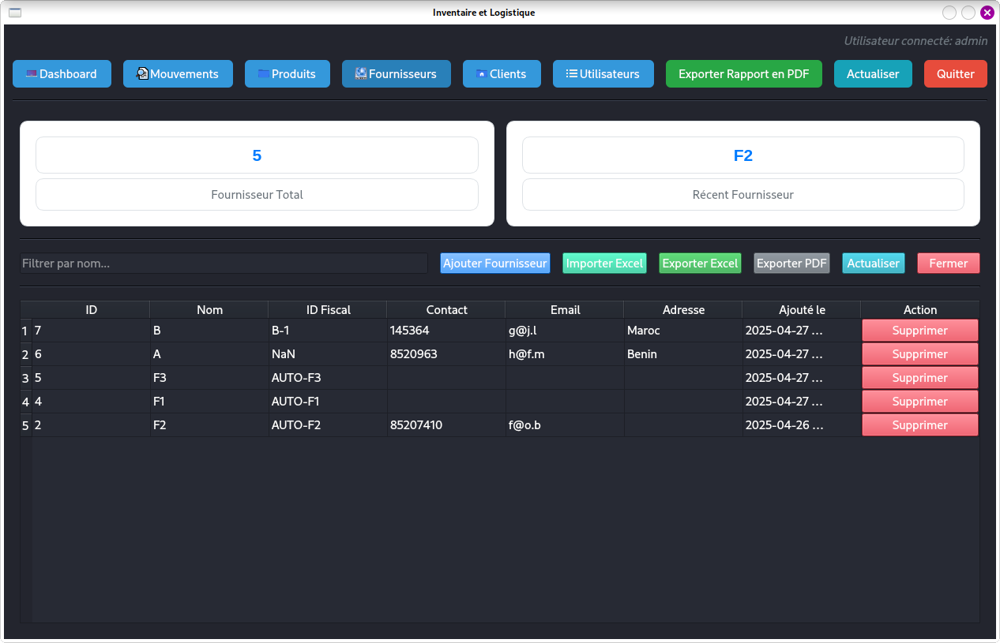

# inventory-logistics
Application Python pour gérer les stocks et la logistique

# Avant le test
## Structure
Le projet est basé sur une architecture modulaire.
- Le dossier __db/__ contient les fichiers de connexion, de schéma et de gestion des données.
- Le dossier __ui/__ contient des sous-dossiers pour chaque module (_product_, _movement_, _supplier_, _client_, _user_) ainsi que le code du tableau de bord principal (_main_interface.py_). Chaque fichier Python contient le code de l’interface graphique correspondant.
- Le dossier __utils/__ contient des fonctions utilitaires.
- Les fichiers __*.xlsx__ contiennent des données pouvant être utilisées pour tester les fonctionnalités d’__importation depuis Excel__.
- Le fichier __main.py__ est le module principal à exécuter.
- Le fichier __first_usage.py__ sert à créer les tables dans la base de données si elles n’existent pas.

## Paramètres de base de données
Cette application utilise __PostgreSQL__.
1. Assurez-vous qu’il est installé sur votre machine, avec ou sans interface graphique, selon votre système d’exploitation.
2. Créez la base de données __inventory_logistics__.
    - Si vous utilisez un terminal sous Linux (par exemple Debian) :
        - Connectez-vous à PostgreSQL :
        ```bash
        psql -U postgres -h 127.0.0.1
        ```
        - Créez votre base de données :
        ```bash
        CREATE DATABASE inventory_logistics;
        ```
        - Vérifiez son existence :
        ```bash
        \l;
        ```
        > Si tout s’est bien passé, vous devriez voir votre nouvelle base dans la liste.
    - Si vous utilisez Windows avec une interface graphique comme PgAdmin, vous pouvez créer la base de données graphiquement.

3. Dans le fichier __db/config.py__, mettez à jour les informations de connexion à la base de données dans la fonction _connect_db()_ :
```python
conn = psycopg2.connect(
    dbname="nom_de_la_base",  # ex. : inventory_logistics
    user="nom_utilisateur",   # ex. : postgres
    password="mot_de_passe",
    host="localhost",
    port="port"               # ex. : 5432
)
```
Cliquez ici pour lire des ressources utiles sur PostgreSQL.

4. Exécutez le fichier first_usage.py pour créer les tables :
```bash
python3 first_usage.py
```

## Dépendances Python
Pour installer les dépendances, référez-vous au fichier `requirements.txt`. Vous pouvez exécuter :
```bash
pip install -r requirements.txt --break-system-packages
```
Ou bien créer un environnement virtuel pour votre application et exécuter la même commande sans __--break-system-packages__.

# Tests
## Connexion
Pour tester l’application, exécutez le fichier `./main.py`. Vous verrez l’interface de connexion suivante :

Un profil administrateur par défaut est enregistré dans la base de données lorsque vous avez exécuté le module first_usage.py. Les identifiants sont :
__Email:__ admin@gmail.com
__Mot de passe:__ admin123

## Ce que vous verrez ensuite (sans données) :




