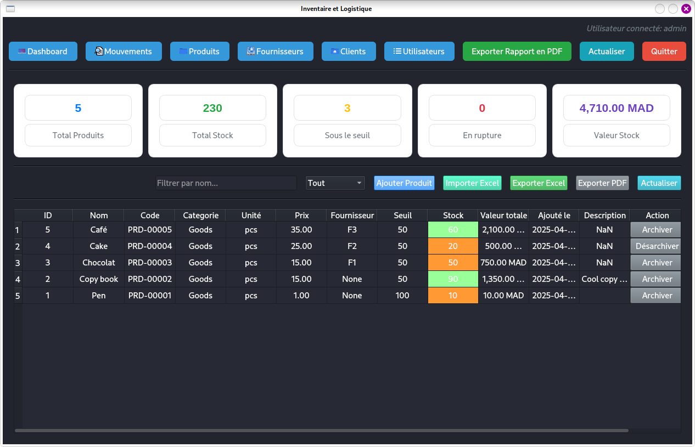
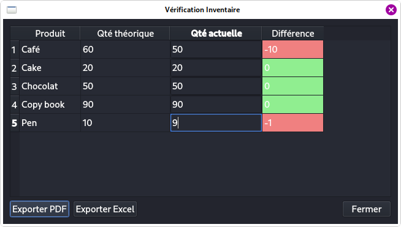
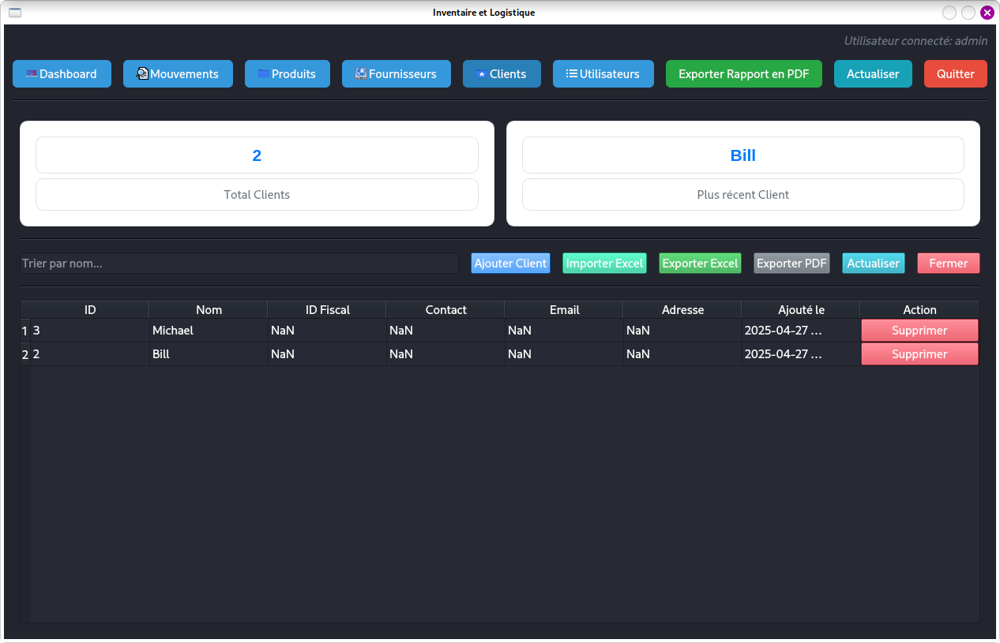

# inventory-logistics
Python based app to manage inventory and logistics

# Before test
## Structure
The project is module-based.
- The __db/__ folder contains files for connection, schema and data management.
- The __ui/__ folder contains subfolders for each modules (_product_, _movement_, _supplier_, _client_, _user_) and main dashboard code (_main\_interface.py_). Each python file contains the appropriate GUI code.
- The __utils/__ folder contains some helpers.
- The __*.xlsx__ files contains data that can be used to test __Import from Excel__ functionalities.
- The __main.py__ file is the main module to execute.
- The __first\_usage.py__ file serves to create tables in database if not exist.

## Database settings
For this app, we use __postgreSQL__. 
1. So ensure to have it installed at your convenience (with or not GUI) according to your OS.
2. Create the database __inventory_logistics__.
    - If you are using terminal on linux OS (debian for example):
        - connect to your Postgres:
        ```bash
        psql -U postgres -h 127.0.0.1
        ```
        - Create your database:
        ```bash
        CREATE DATABASE inventory_logistics;
        ```
        - Verify the existence of your database:
        ```bash
        \l;
        ```
        > If all has gone well, you should see in the list your new database.
    - If you are using windows OS with GUI like PgAdmin, you can launch your GUI and create graphically your database.
3. In the file __db/config.py__, update the database connexion info in the function _connect_db()_:
```python
conn = psycopg2.connect(
    dbname="database_name", # ex.:inventory_logistics
    user="username", # ex.: postgres
    password="password", 
    host="localhost",
    port="port" # ex.: 5432
)
```

> Click [here](https://www.tutorialspoint.com/postgresql/index.htm) to read some useful PostgreSQL overviews.

4. Run the `first_usage.py` file to create tables:
```bash
python3 first_usage.py
```

## Python dependancies
To install the dependancies, refer to the `requirements.txt` file. You can run:
```bash
pip install -r requirements.txt --break-system-packages
```
Or create a virtual environnement for your app and run the same command without `--break-system-packages`.

# Testing
## Login
To test the app, run the file `./main.py`. You will see the following login interface:

There is a default admin profile saved in your database when you executed the `first_usage.py` module.
The credentials are:
- __Email:__ admin@gmail.com
- __Password:__ admin123

## What you will see then (without data):






